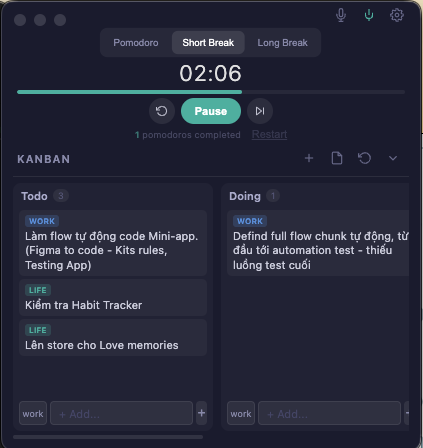

# Pomodo

A minimal, beautiful desktop Pomodoro timer with an integrated Kanban board and AI-powered voice commands. Built with Electron and vanilla JavaScript — no frameworks, no bundlers.



## Downloads

| Platform | Download |
|----------|----------|
| macOS (Apple Silicon) | [Pomodo-1.0.0-arm64.dmg](https://github.com/VinhHung1999/pomodoro/releases/latest) |
| macOS (zip) | [Pomodo-1.0.0-arm64-mac.zip](https://github.com/VinhHung1999/pomodoro/releases/latest) |
| Windows | [Pomodo Setup 1.0.0.exe](https://github.com/VinhHung1999/pomodoro/releases/latest) |

## Features

### Pomodoro Timer
- **25/5/15 timer** — Pomodoro (25 min), Short Break (5 min), Long Break (15 min)
- **Auto-cycling** — Automatically switches between work and break sessions. After 4 pomodoros, triggers a long break
- **Progress bar** — Visual progress indicator for the current session
- **Bell sound** — Web Audio synthesized bell plays when a session completes
- **OS notifications** — Native macOS/Windows notifications when the app is unfocused, plus in-app toast when focused
- **Dock bounce** — macOS dock icon bounces on session complete (when unfocused)
- **Keyboard shortcuts** — `Space` to start/pause, `R` to reset

### Kanban Board
- **Markdown-based** — Reads and writes standard `.md` files, fully compatible with the [Obsidian Kanban plugin](https://github.com/mgmeyers/obsidian-kanban)
- **4-column workflow** — Todo, Doing, Review, Done (customizable via markdown)
- **Drag and drop** — Move tasks between columns by dragging
- **Inline editing** — Double-click any card to edit its text instantly
- **Context menu** — Right-click (or click `...`) to move, edit, or delete tasks
- **Tags** — Organize tasks with `work` / `life` tags, color-coded for quick scanning
- **Create new boards** — Create new kanban files directly from the app with proper Obsidian-compatible template
- **Auto-refresh** — Board reloads when the app window regains focus

### AI Voice Commands
Control your Kanban board entirely by voice — powered by **Soniox** (real-time speech-to-text) and **xAI Grok** (natural language understanding).

- **Real-time transcription** — Soniox streaming STT with Vietnamese and English support
- **Natural language parsing** — Speak naturally to manage tasks, xAI Grok interprets your intent
- **Supported actions:**
  - *"Tao task moi: Lam bao cao"* — Creates a new task in Todo
  - *"Chuyen task Lam bao cao sang Doing"* — Moves task to Doing column
  - *"Xoa task Lam bao cao"* — Deletes the task
  - *"Sua task Lam bao cao thanh Viet bao cao Q1"* — Edits task text
- **Fuzzy matching** — Finds the closest matching task even with imperfect voice input
- **Global shortcut** — Trigger voice recording from anywhere with `Ctrl+Option+V` (customizable)

### Other
- **Always-on-top** — Pin the timer above all windows while you work
- **Compact mode** — Timer-only view (190px height) when Kanban is hidden, expands to full view with Kanban
- **Dark theme** — Easy on the eyes with mode-specific accent colors:
  - Pomodoro: red (`#e74c6f`)
  - Short Break: teal (`#4caf9e`)
  - Long Break: blue (`#5b8cde`)
- **Settings panel** — Configure API keys, Kanban file path, and voice shortcut

## Setup

### Basic (Timer + Kanban)
Just download and run — no configuration needed. Click the `+` button to create a new Kanban board, or the file icon to open an existing `.md` file.

### Voice Commands (Optional)
To enable AI voice commands, open Settings and add:
1. **Soniox API Key** — Get one at [soniox.com](https://soniox.com) for real-time speech-to-text
2. **xAI API Key** — Get one at [x.ai](https://x.ai) for natural language command parsing

## Development

```bash
npm install           # Install dependencies
npm start             # Run in dev mode
npm run build         # Build for macOS only
npm run build:all     # Build for macOS + Windows
```

## Tech Stack

- **Electron** — Desktop runtime with context isolation
- **Vanilla JS** — No React, no Vue, no frameworks
- **Web Audio API** — Synthesized bell sounds (no audio files)
- **Soniox WebSocket** — Real-time streaming speech-to-text
- **xAI Grok API** — Voice command intent parsing
- **Markdown** — Kanban data stored as plain text (Obsidian-compatible)

## Kanban File Format

```markdown
---
kanban-plugin: board
---

## Todo
- [ ] [work] Build the feature
- [ ] [life] Buy groceries

## Doing
- [ ] [work] Design the API

## Review

## Done
- [x] [work] Setup project
```

## Architecture

Three-file Electron architecture with full context isolation:

| File | Role |
|------|------|
| `main.js` | Main process: window, IPC handlers, Soniox WebSocket, xAI API, OS notifications |
| `preload.js` | Security bridge: exposes safe APIs via `contextBridge` |
| `src/renderer.js` | All UI: timer state machine, Kanban rendering, voice recording, drag-and-drop |

## License

MIT
